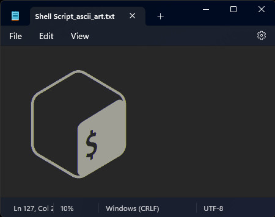

# ASCII Art Generator

This is a simple script that converts an image to ASCII art. It uses the `chunky_png` gem to read the image file and then converts each pixel to an ASCII character based on its intensity level.

## Usage

To use the script, you need to have Ruby installed on your system.

1. Clone this repository.
2. Install the required gem by running `gem install chunky_png`.
3. Run the script with the following command: `ruby IMG2ASCII.rb <image_path>`, where `<image_path>` is the path to the image you want to convert to ASCII art.

For example, if you want to convert an image called `my_image.png`, you would run: `ruby IMG2ASCII.rb my_image.png`.

The ASCII art will be saved in a file called `<image_name>_ascii_art.txt` in the same directory as the image file.

## Output

</a>

## Dependencies

This script requires the `chunky_png` gem. You can install it by running:

```bash
gem install chunky_png
```

## Author

- Ali (Real0x0a1)

---
